#### Day 1: 26 OCTOBER 2022  	
<h1 align="center">GIT COMMANDS</h1>

## User git Configuration:  
“git config” command is used to configure the user.  
To configure user name:  
```
$ git config --global user.name <user_name>
```  
To configure user email:  
```
$ git config –-global user.email <user_email>
``` 

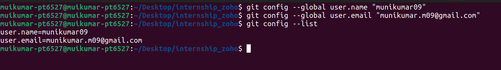


## git initialization:  
git initialization means converting a current working directory into git repository. “git init” commad is used to initailize git repository.  
```
$git init
```
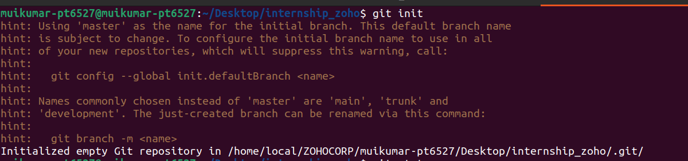

## git status:  
“git status” command is used to display the state of current working directory and staging area(index file). It simply shows the difference between working tree and index file.  
```
$ git status
```
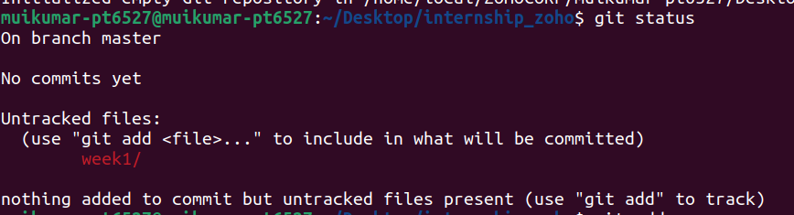  
## git add:  
to update the changes in the current working tree to the staging area or index file we have to use “git add” command. It also prepare the staged contents to next commit.  
To add single file to the stanging area:  
```
$ git add file1
```  
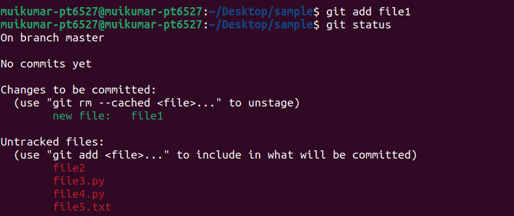  
To add more than one file:   
```
$ git add file1 file2
```  
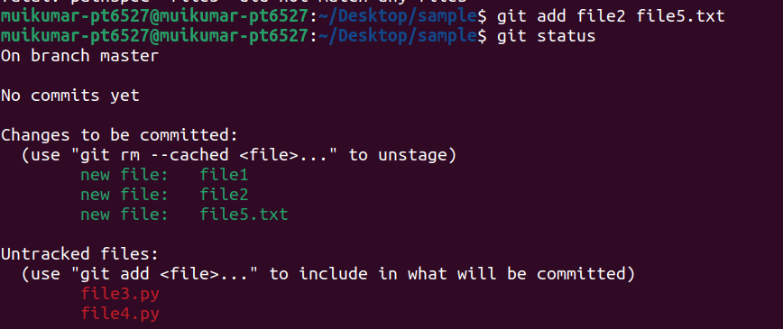  
To add all the files of specific type:  
```
$ git add *.py
```  
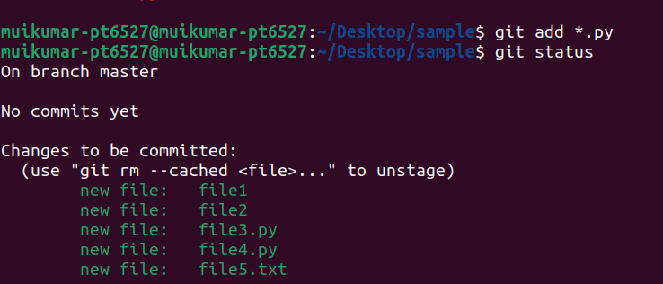  
To add all the files in the current working directory:  
```
$ git add .
```  
## git commit  
The "git commit" command captures a snapshot of the project's currently staged changes. flag "m" can be used to write message along with the commit.  
```
$ git commit -m <message>
```
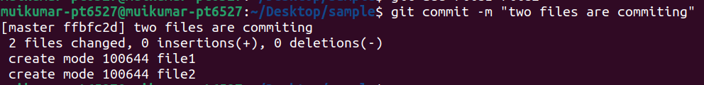  
## git diff  
git diff lists out the changes between your current working directory and your staging area.  
```
$ git diff
```
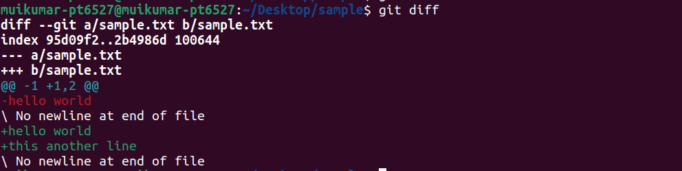  
to compare two commits we have to use their hash value  
```
$ git diff <commit1_hash> <commit2_hash>
```  
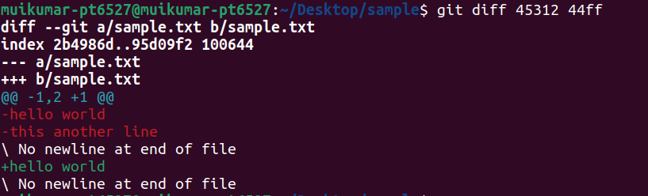  
## git branch  
a branch is a new/separate version of the main repository. Branches allow us to work on different parts of a project without impacting the main branch. When the work is complete, a branch can be merged with the main project.
Head branch is currently active branch or checkout branch  
We have to use branch keyword to create a new branch
```
$ git branch <branch_name>
```   
To rename currently working branch we have to and excute the following command
```
$ git branch -m <new_branch_name>
```
To rename other branches  
```
$ git branch -m <old_branch_name> <new_branch_name>
```
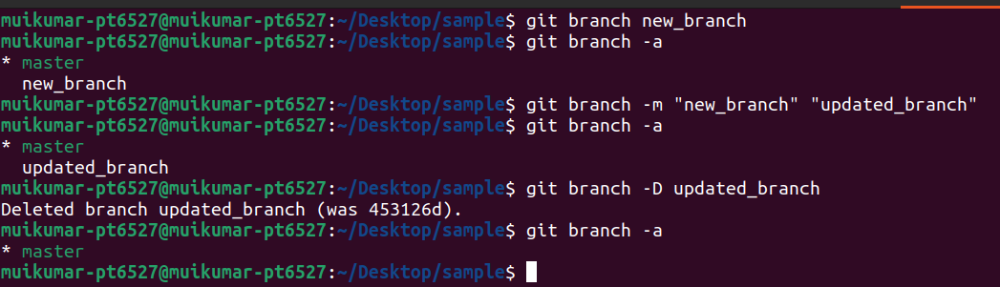  
Rename remote branch is not possible for that we have to first delete the remote branch and publish the newly named branch.  
deleting remote branch
```
$ git push origin --delete <old_branch_name>
```
push local branch with correct name  
```
$ git push -u origin <new_branch_name>
```
deleting a local branch  
```
$ git branch -d <branch_name>
```
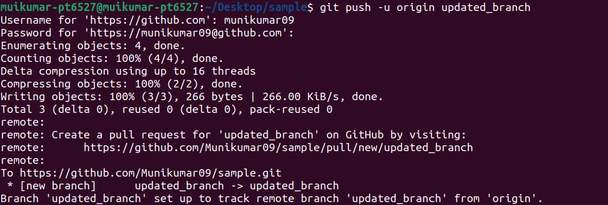  
## git checkout  
"git checkout" command allow us to navigate between the different branches created by the git branch command.  
To switch between branches
```
$ git checkout <branch_name>
```
To create a branch and navigate to it
```
$ git checkout -b <branch_name>
```
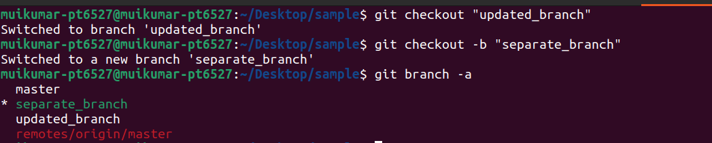  
## git fetch  
The git fetch command downloads commits, files, and refs from a remote repository into your local repo. It fetches branches and tags from one or more repositories.
To fetch from the currently configured remote repository  
```
$ git fetch
```
to fetch from the specified remote repository
```
$ git fetch <remote>
```
To fetch from the all the registered remote repositories
```
$ git fetch all
```
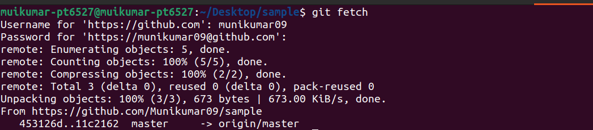  
## git pull  
The git pull command is used to fetch and download content from a remote repository and immediately update the local repository to match that content.  
git pull= git fetch + git merge  
To fetch from the currently configured remote repository  
```
$ git pull
```
to fetch from the specified remote repository
```
$ git pull <remote>
```
Gives verbose output during a pull which displays the content being downloaded and the merge details.
```
$ git pull --verbose
```
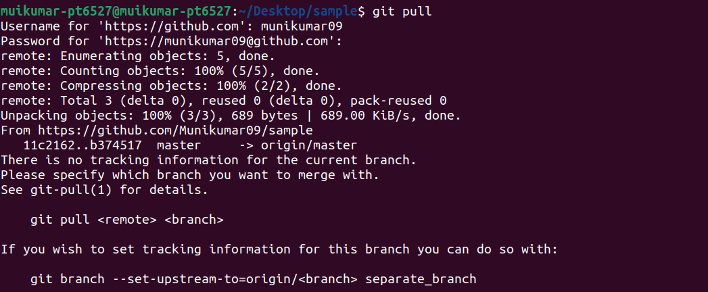  
## git push  
The git push command is used to upload local repository content to a remote repository.  
To push content to a remote repository  
```
$ git push <remote>
```
Push all of your local branches to the specified remote.
```
$ git push <remote> --all
```
push only modified files
```
$ git push -u <remote>
```
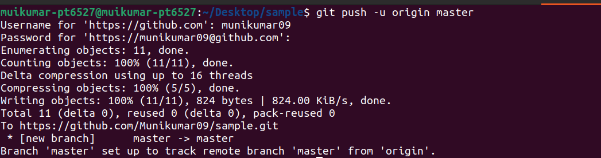  
## git merge  
The git merge command lets you take the independent lines of development created by git branch and integrate them into a single branch.
Git merge will combine multiple sequences of commits into one unified history.
```
$ git merge <branch_name>
```
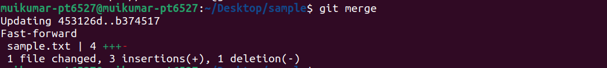  
## git reset  
"git reset" command is used to undo local changes to the state of a Git repo. It is also used to undo the commits.
To clear the stagin area  
```
$ git reset
```
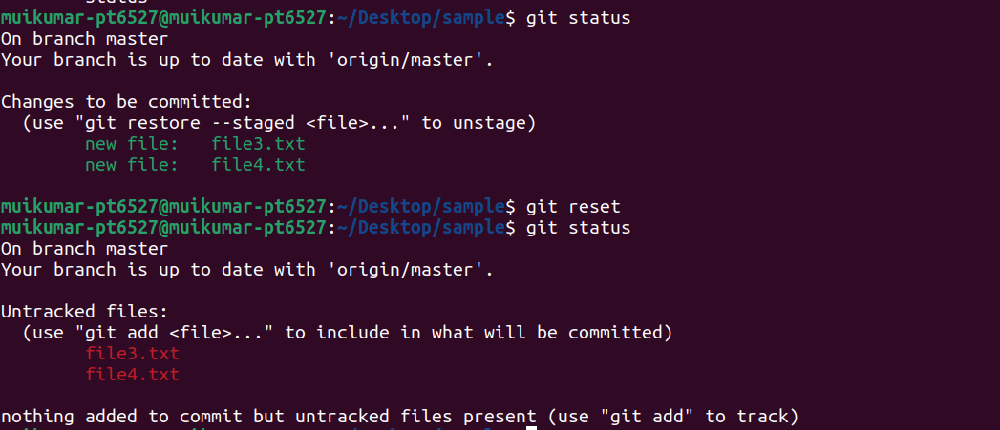  
To unod or jump to specific commit
```
$ git reset --hard HEAD^
```
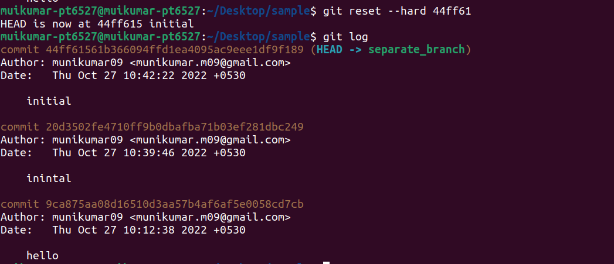  
## git rebase  
Rebasing is the process of moving or combining a sequence of commits to a new base commit. Git rebase rewrites commits from one branch onto another branch and its useful alternative to mergeing because it gives clear repo history.  
```
$ git rebase <branch_name>
```
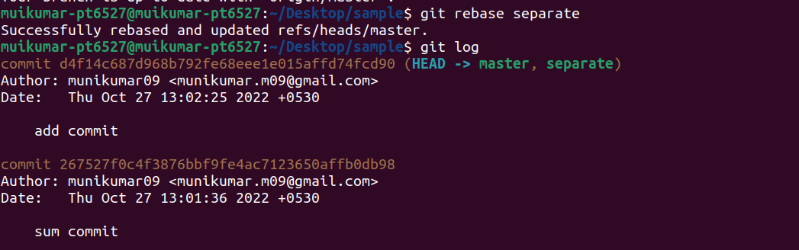  
## git log  
Git log is a utility tool to review and read a history of everything that happens to a repository.  
```
$ git log
```
To display log details in breif:  
```
$ git log --oneline
```
To display the changes done in each commit:  
```
$ git log --stat
```
To graphically represent the repo history:  
```
$ git log --graph
```
To view some of the latest commits:  
```
$ git log -<number>
```
