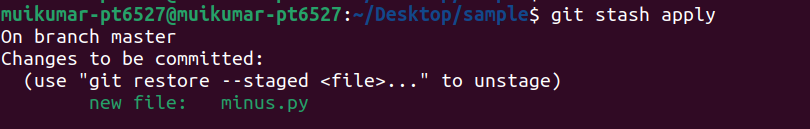

## Day 2: 27 OCTOBER 2022
<h1 align="center">GIT COMMANDS AND CONCEPTS</h1>  

## git stash  
Git has an area called the stash where we can temporarily store a snapshot of our changes without committing them to the repository. It's separate from the working directory, the staging area, or the repository.  
To stash the changes in the working directory:  
```
$ git stash
```
To show the entries in the stashed stack:  
```
$ git stash list
```
  
To apply the last saved changes in the stash to the current working directory:  
```
$ git stash apply
```
To apply the specified changes in the stash to the current working directory
```
$ git stash apply <stash_number>
```
  
To apply the last saved changes in the stash to the current working and delete from the stash stack:
```
$ git stash pop
```
To clear the stash area:  
```
$ git stash clear
```
## git tag  
Tagging in git refers to creating specific points in history for your repository. This is usually done to mark release points.  
Creating light weight tag on current branch:  
```
$ git tag <tag_name>
```
Creating annotated tag on current branch:
```
$ git tag -a <tag_name> -m "tag message"
```
To display all the tags:  
```
$ git tag
```
  
To push a single tag from local repository to remote repository:  
```
$ git push origin <tag_name>
```
  
To push all tags from local repository to remote repository:  
```
$ git push origin --tags
```
To delete tag from local repository:  
``` 
$ git tag origin <tag_name>
```
To delete tag from remote repository:  
```
$ git push origin -d <tag_name>
```
  
## git cherry-pick  
cherry picking in git means to choose a commit from one branch and apply it into another branch. To use cherry pick command we have to on branch where we have to apply the commit.  
```
$ git cherry-pick <commit-hash>
```
  
<h1 align="center">Git Concepts</h1>  

## Repository
Repository is a container that stores everything related to out project. Git is a Version Control System(VCS) or program that tracks changes made to files. After initialization of git it creates ".git" repository which tracks all the changes made on files in our project to build a history over time.  
## branch  
In git, branch is separate version of out main repository. Branches allow us to work on different parts of the the project without having impact on the main repository. Whenever our work is complete we can merge the current branch into the main repository. We can switch between branches and work on different projects without interfering with each other.  
## remote
A remote repository in Git is also called as remote and it is a Git repository that's hosted on the Internet or another network. It is a common repository that all team members use to exchange their changes on the project. The `git remote` command lets us to create, view, and delete connections to other repositories. It is simply a place to where we have to push the commited changes and from where we can fetch the project files.  
To list all the remotes configured to the local repository:  
```
$ git remote -v
```
  
To add a new remote repository:  
```
$ git remote add <remote_repository_name> <remote_repository_address>
```
  
To rename a remote repository:  
```
$ git remote rename <old_remote_repository_name> <new_remote_repository_name>
```
  
To delete a remote repository:
```
$ git remote remove <remote_repository_name>
```