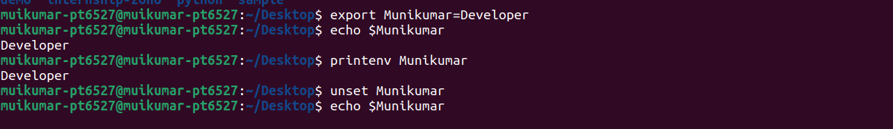
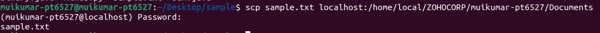
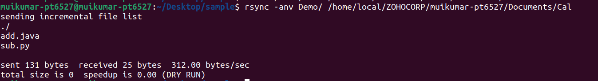

## day3: 28 October 2022  
<h1 align="center"> GIT CONCEPTS </h1>

## Local and Remote branches  
The local branch exists on the local machine and can be seen only by the local user. The remote branch is a branch on a remote location or on the internet.  
#### local branch  
On our machine there are three types of branches  
1. non-tracking local branches  
2. tracking local branches  
3. remote tracking branches  
##### non-tracking local branches  
Non-tracking local branches are not associated with any other branches. They can be created by:  
```
$ git branch <branch-name>
```
##### Tracking local branches  
Tracking local branches are associated with any other branches, generally with a remote-tracking branch. They can be created by:  
```
$ git branch --track <branch-name> <starting-point>
```
We can view the list of branches along with their types by the following command:  
```
$ git branch -vv
```
##### Remote Tracking branches  
Remote-tracking branches can be assumed as our local cache for what the remote machines contain. We can update your remote-tracking branches using git fetch.  
We can view a list of all the remote-tracking branches on our machine by running:  
```
$ git branch -r
```
##### Remote branches  
We can view all the remote branches by running the following command:  
```
$ git remote show <remote_name>
```
We can update the remote brach by `git fetch`, `git pull` and `git push` commands.  
## Synchronization between local and remote repositories  
There may be many people work on the same project as team and each team member may work on different aspects of the project. You may work on something on your local repository after cloning the project and cetain files will differ in both repositories as there are many other developers are merging the code upstream and your branch will not have that changes unless you sync the repository with the current upstream, so you might need to keep up with their code changes as well, this is called syncing your changes with your local and remote repository.  
To sync the local and remote repositories:  
```
$ git fetch <remote>
$ git checkout <branch_name>
$ git merging <remote_name>
```
## Deleting local and remote branch  
They are a great way to work on different features and fixes while isolating the new code from the main codebase.Once work is completed on a feature, it is often recommended to delete the branch.  
__What happens when you delete a local branch?__  
If we delete the local branch, as it is present in the local machine it won't effect the remote branch.  
If local branch which we work on is not the main or master branch, if it is already integrated with the original branch there is nothing changed because the original branch head points to the latest commit.  
To delete local branch safely:  
```
$ git branch -d <branch_name>
```
To delete local branch forcefully:  
```
$ git branch -D <branch_name>
```
__What happens when you delete a remote branch?__  
When we delete remote branch it does not show any impact on the local branch because it resides on the remote location.  
To sync between remote tracking branches and remote branches we can use `prune` flag.  
```
$ git push origin --prune
```
## Pull Requests and Merge Requests  
Pull request means submitting your code contributions to an onging project where you work as a team. This request allows the team to discuss and review the suggested changes, perhaps even adding follow-up commits, before the changes are merged with the base branch.  

A Git pull request is the same as Git merge request, with both achieving the same result: merging a developer‘s branch with the project’s master branch or main branch.  
Pull request is a github specific feature whereas merge request is gitlab specific feature.  
## Fast forward merge  
Fast forward merge can be performed when there is a direct linear path from the source branch to the target branch. In fast-forward merge, git simply moves the source branch pointer to the target branch pointer without creating an extra merge commit.  
To do only fast forward merge:  
```
$ git merge --ff-only <source_branch>
```
## Squashed merging  
Squash merging is a merge option that allows you to condense the Git history of topic branches when you complete a pull request. Instead of each commit on the topic branch being added to the history of the default branch, a squash merge adds all the file changes to a single new commit on the default branch.  
```
$ git merge --squash <source_branch>
```
## Head in git  
The HEAD points out the last commit in the current checkout branch. It is like a pointer to any reference. The HEAD can be understood as the "current branch." When you switch branches with 'checkout,' the HEAD is transferred to the new branch.  
The git show head is used to check the status of the Head. This command will show the location of the Head.  
```
$ git show HEAD
```
## What happens when you try to merge branch source into branch target, but target is ahead?  
A fast forward merge is not possible in this case. Instead a new commit is added to the master branch that contains all of the new changes.  

```$ git checkout master
$ git merge <feature_branch>
```
Rebase  

The other way is to rebase the feature branch onto master .The branch commits are removed, and added after the current state of the target.  

```$ git checkout <feature_branch>
$ git rebase master
```
## Git vs Github vs Gitlab  
Git: GIT is a open source distributed version control system used by programmers collaboratively developing code during a software development. It keeps track of the changes made in a set of files.  

GitHub: GitHub is a cloud based git repository hosting service.  

Git Lab: Git lab is a web-based devops life cycle tool provides a git repository manager provides wiki, issue tracking and CI/CD pipe line.  

Git Lab has advanced and different features than GitHub & Git:  

Authentication Levels: Git lab having features like adding and modifying people’s permissions according to their roles.  

Built-in CI/CD tool: GitLab having the feature like automatically testing with CI/CD and no need of humans. It also integrates with external integration applications like jenkins, etc…  

<h1 align="center">Linux Command Line</h1>

## bashrc  
The .bashrc file is a script file that’s executed when a user logs in. The file itself contains a series of configurations for the terminal session. This includes setting up or enabling: coloring, completion, shell history, command aliases, and more.  
To view the bashrc file  
```
$ cat .bashrc
```
To create a .bashrc file  
```
$ touch .bashrc
```
To reflect the changes in bashrc  
```
$ source .bashrc
```
## environment variable  
he environment variables are dynamic values that are stored within a system and used by applications launched in shells or sub-shells.  
To create new Environment variable:  
```
$ export Variable_name=Value
```
To display the value of the variable, use the $ symbol before the variable name:  
```
$ echo $[variable_name]
```
Use the printenv command to check whether this variable is an environment variable or not:  
```
$ printenv <variable_name>
```
To unset an environment variable:  
```
$ unset Variable_name
```
To display all the environment variables:  
```
$ env
```

If we want to store environment variables permanently in system then we have to store them in `.bashrc` file or `/etc/environment` file  
A .env file or dotenv file is a simple text configuration file for controlling your Applications environment constants.  
To create env file:  
```
$ touch .env
```
#### SSH  
The Secure Shell(SSH) command provides a secure encrypted connection between two hosts over an insecure network.
To establish ssh connection to remote machine:  
```
$ ssh [username]@[server]
```
#### SCP
SCP or secure copy allows secure transferring of files between a local host and a remote host or between two remote hosts.
```
$ scp <source_file_name> <username@destination_host:destination_folder>
```

#### Rsync:  
sync, which stands for remote sync, is a remote and local file synchronization tool.  
```
$ rsync <options> <source> <destination>
```

-v : verbose  

-r : copies data recursively (but don’t preserve timestamps and permission while transferring data.  
-a : archive mode, which allows copying files recursively and it also preserves symbolic links, file permissions, user & group ownerships, and timestamps.  
-z : compress file data.  

#### find:  
It can be used to find files and directories and perform subsequent operations on them. It supports searching by file, folder, name, creation date, modification date, owner and permissions.
To find a file with specific name:  
```
$ find <./folder_name> -name <file_name>
```
To search for empty files and directories:  
```
$ find <./folder_name> -empty
```
#### grep:  
The grep filter searches a file for a particular pattern of characters, and displays all lines that contain that pattern. The pattern that is searched in the file is referred to as the regular expression.  
```
$ grep [options] pattern [files]
```
Options Description  
-c : This prints only a count of the lines that match a pattern  
-i : Ignores, case for matching  
-n : Display the matched lines and their line numbers.  
-v : This prints out all the lines that do not matches the pattern  
#### wc command:  
wc stands for word count. It is used to find out number of lines, word count, byte and characters count in the files specified in the file arguments.
```
$ wc [OPTION] [FILE]
```
-c, --bytes  
print the byte counts  

-m, --chars  
print the character counts

-l, --lines  
print the newline counts  

-L, --max-line-length  
print the maximum display width  

-w, --words  
print the word counts  
#### head/tail/less/more  
head : to display specified number of lines from top of the file.  
```
$ head -n <file_name>
```
tail : to display specified number of lines from bottom of the file.
```
$ tail -n <file_name>
```
more : to view a text file one page at a time, press spacebar to go to the next page
```
$ more -n <file_name>
```
less : it will display one page of a file at a time and let you scroll up and down through the file at your leisure.
```
$ less <file_name>
```
#### which
The Linux which command is used to locate the executable files or location of a program from the file system. It displays the path where the specified file or command is stored.
```
$ which <program name>  
```
#### Mount a disk to your machine:  
Mountpoint: A mount point is a directory in the currently accessible filesystem on which an additional filesystem can be mounted. In simple words, mount point is nothing but a directory meant for accessing data in a storage device.
__fstab__: fstab file is a plain text configuration file that contains information about the major filesystem on a computer.
To view the contents in fstab file:  
```
$ cat etc/fstab
```
To mount a disk or partition:  
```
$ mount -t type device dir
```
To unmout a partition:  
```
$ unmount directory
```
To check partitions in a disk:  
```
$ sudo fdisk -l
```
#### apt:  
Advanced Package Tool, more commonly known as APT, is a collection of tools used to install, update, remove, and otherwise manage software packages on Debian and its derivative operating systems, including Ubuntu and Linux Mint. APT works through the use of repositories, or special directories that hold collections of software packages.
To update package index:  
```
$ sudo apt update
```
To upgrade the installed packages to their latest versions:  
```
$ sudo apt upgrade
```
To install packages:  
```
$ sudo apt install <package_name>
```
To remove installed package:  
```
$ sudo apt remove <package_name>
```