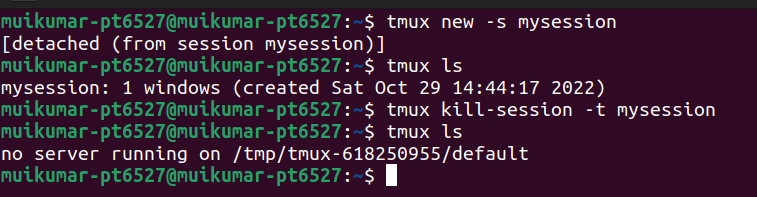
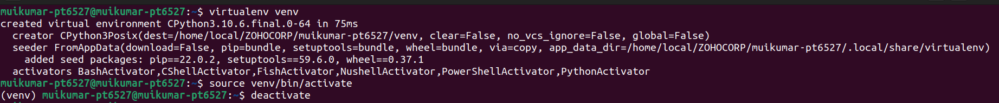
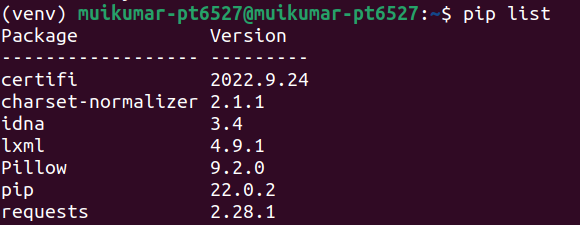
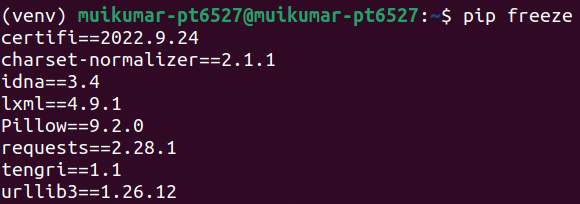
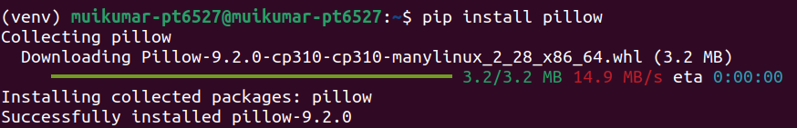
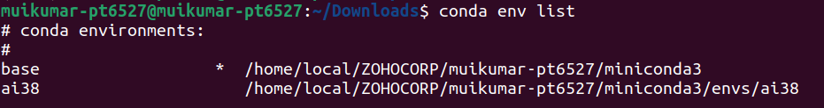
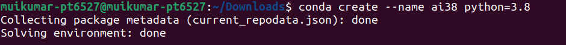
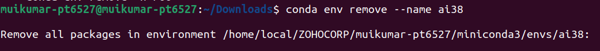

## day 4: 29 October 2022  
<h1 align="center"> tmux</h1>

## tmux  
tmux is a terminal multiplexer. Within one terminal window you can open multiple windows and split-views. Each pane will contain its own, independently running terminal instance. This allows you to have multiple terminal commands and applications running visually next to each other without the need to open multiple terminal emulator windows.  
## install tmux:  
```
$ sudo apt install tmux
```
## tmux commands:  
##### session:  
To start a new Session:  
```
$ tmux new
```
To start a new session with name:  
```
$ tmux new -s <name>
```
To kill a session:  
```
$ tmux kill-ses -t <name>
```
To kill all sessions but not the current one:  
```
$ tmux kill-session -a
```
To rename a session:  
```
ctrl + b $
```
To detach from a session:  
```
ctrl + b d
```
To show all the sessions:  
```
$ tmux ls
```
Attach to a session with given name:  
```
$ tmux a -t <name>
```
To preview all the sessions:  
```
ctrl +b w
```
To switch to preview session:  
```
ctrl + b (
```
To switch to preview session:  
```
ctrl + b )
```
##### window  
To create a window:  
```
ctrl + b c
```
To rename current window:  
```
ctrl + b ,
```
To close current window:  
```
ctrl + b &
```
To swith to previous window:  
```
ctrl + b p
```
To switch to next window:  
``` 
ctrl + b n
```
## pane
To split pane with horizontal layout:  
```
ctrl + b %
```
To split pane with verticle layout:  
```
ctrl + b "
```
To switch pane to the directions:  
```
ctrl + b →
ctrl + b ←
ctrl + b ↑
ctrl + b ↓
```
To close the pane:  
```
ctrl + b x
```
To convert the pane into window:  
```
ctrl + b !
```
To toggle pane zoom:  
```
ctrl + b z
```
  
##### .tmux.conf file  
To customize the tmux configuration, its default configuration file: tmux.confcan be changed. This file is invoked by Tmux at startup. Tmux first looks for the system configuration file inside the directory ‘/etc/tmux.conf’, if it is absent, it then searches inside the home directory of the user. To open tmux.conf file  
## virtualenv  
A virtual environment is a Python environment such that the Python interpreter, libraries and scripts installed into it are isolated from those installed in other virtual environments, and libraries installed in the system Python (base). 
To install virtualenv:  
```
$ sudo apt install virtualenv
```
To create a virtual environment:  
```
$ virtualenv <name>
```
To activate virtualenv:  
```
$ source venv/bin/activate
```
To deactivate virtualenv:  
```
$ deactivate
```
  
## pip  
__what is package manager__  
A package manager or package-management system is a collection of software tools that automates the process of installing, upgrading, configuring, and removing computer programs for a computer in a consistent manner.  
__pip__  
PIP is a package management system used to install and manage software packages written in Python. PIP for Python is a utility to manage PyPI package installations from the command line.  
To install pip:  
```
$ sudo apt install pip
```

To list all the python package:  
```
$ pip list
```
  
To list only external packages:  
```
$ pip freeze
```
  
To install a package:  
```
$ pip install <package_name>
```
  
To checkout if updates are available for the installed packages:  
```
$ pip list -o
```
To update a package:  
```
$ pip install -U <package_name>
```
To save our installed packages into a text file:  
```
$ pip freeze > requirments.txt
```
To install list of packages from a text file:  
```
$ pip install -r <textfile>
```
## Conda  
Conda is an open source package and environment management system that runs on Windows, Mac OS and Linux. Conda can quickly install, run, and update packages and associated dependencies.  
To Download and install Conda(miniconda):  
```
wget --quiet https://repo.anaconda.com/miniconda/Miniconda3-latest-Linux-x86_64.sh
./Miniconda3-latest-Linux-x86_64.sh
```
To list all the environments in conda:  
```
$ conda env list
```
  
To create new conda Environment:  
```
$ conda create --name <environment_name> python=<version>
```
  
To activate an environment:  
```
$ conda activate <environment>
```
  
To deactivate an environment:  
```
$ conda deactivate
```
To desable auto environment activation:  
```
$ conda config --set auto_activate_base false
```
To remove an environment:  
```
$ conda env remove --name <environmet>
```
  


