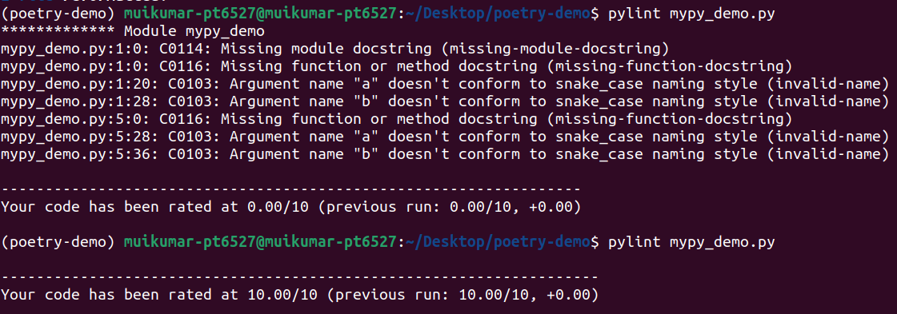

## week 2: day 1  
#### 31 october 2022  
<h1 align="center">Poetry</h1>  
Poetry is a tool for dependency management and packaging in Python. It allows you to declare the libraries your project depends on and it will manage them for you. Poetry offers a lockfile to ensure repeatable installs, and can build your project for distribution.  

### installing poetry:  
To install poetry  
```
$ curl -sSL https://install.python-poetry.org | python3 -
```
  
### update poetry:  
Poetry is able to update itself when installed using the official installer.  
```
$ poetry self update
```
### Adding dependencies:  
You can add git dependencies:  
```
poetry add git+[repository]
```
  
adding from local directory:  
```
poetry add [directory]
```
### Poetry.lock file:  
the poetry. lock file prevents you from automatically getting the latest versions of your dependencies.  
__Creating poetry lock file inside conda env__  
```
$ conda create --name <environment_name> python=<version>
$ conda activate <environment>
$ poetry new <name>
$ poetry lock
```
  
To add dependencies:  
```
$ poetry add <dependency>
```
  
To update dependencies:  
to update a few packages and not all, you can list them as such:  
```
$ poetry update <dependency1> <dependency2>
```
To update all the dependencies:  
```
$ poetry update
```
#### Poetry config:  
Poetry can be configured via the config command or directly in the config.toml file that will be automatically be created when you first run that command.  
```
$ poetry config --list
```
  
### Uninstall poetry:  
To uninstall poetry:  
```
$ curl -sSL https://install.python-poetry.org | python3 - --uninstall
```
<h1 align="center">Black and Isort</h1>

black and isort are code formatters that will modify your python code to conform to (PEP8) standards.  
__black__ looks at things like indentation, line length, use of double quote for strings, trailling commas in multi-line lists/tuples/dicts, and much more.  
__isort__ is primarily focused on the location and order of imports in your modules. It will automatically sort your imports alphabatically, as well as split up your imports into sections, normally for standard library, 3rd party libraries, and your own project's modules/packages  
To install black:  
```
$ pip install black
```
To install isort:  
```
$ pip install isort
```
To preview the changes that will be made by black:  
```
$ black --diff <file>
```
To preview the changes that will be made by isort:  
```
$ isort --diff <file>
```
To format code by black:  
```
$ black <file>
```
To formate code by isort:  
```
$ isort <file>
```
Before black and isort formatting:  
```


import aggrigate

import os


def add(num1,                num2):
    return num1          + num2
def sub(num1,    num2):
    return num1 - num2
def mul(num1,       num2):
    return num1    * num2
def div(num1,num2):
    return num1/num2
```
After black and isort formatting:  
```
import os

import aggrigate


def add(num1, num2):
    return num1 + num2


def sub(num1, num2):
    return num1 - num2


def mul(num1, num2):
    return num1 * num2


def div(num1, num2):
    return num1 / num2
```
To check if the code is already formatted or not:  
```
$ black <file> --check
```
To check If all the imports are properly ordered:  
```
$ isort <file> -c
```
<h1 align="center">Mypy</h1>  

### Type checking:  
Type checking is the process of verifying and enforcing the constraints of types, and it can occur either at compile time (i.e. statically) or at runtime (i.e. dynamically). Type checking is all about ensuring that the program is type-safe, meaning that the possibility of type errors is kept to a minimum.  

### static and dynamic type checking:   
In Dynamic Typing, type checking is performed at runtime. For example, Python is a dynamically typed language. It means that the type of a variable is allowed to change over its lifetime.Static Typing is opposite to Dynamic Typing. In Static Typing, type checking is performed during compile time. It means that the type of a variable is known at compile time.  
### type checker:  
A type checker for a simple language checks the type of each identifier. The type checker is a translation scheme that synthesizes the type of each expression from the types of its subexpressions.  
### need of type checking in python:  
Since Python is a dynamic language, it doesn't force the user to enforce the type of the objects, which can lead to bugs, and errors will be hard to find. To overcome this python need a type checking machanism.  
__mypy__ is a static type checker for Python.
To install mypy:  
```
$ pip install mypy
```
To run python file with mypy:  
```
$ mypy <python_file>
```
To skip or ignore error in mypy:  
```
# type: ignore
```
To skip file from being checked by Mypy you have to use `# type: ignore` at the top of the file.  
__5. mypy.ini:__  
a. What are the contents of this file
mypy.ini is the mypy configuration file. It contains section names in square brackets and flag settings of the form NAME = VALUE.  

<h1 align="center">Pylint</h1>

1. What is Linting / Static Code analysis  
A Code linter, is a static code analysis tool used to flag programming errors, bugs, stylistic errors, and suspicious constructs.  
2. Write an example program and run pylint over that file  
To install pylint:  
```
$ pip install pylint
```
Before rectifying the errors in code with pylint:  
```
def add_two_numbers(a: int, b: int) -> int:
    return a + b


def concatinate_two_strings(a: str, b: str) -> str:
    return a + b 

print(add_two_numbers(10, 20))
```
After rectifying the errors in code by using pylint:  
```
""" Performs arithmetic operations"""


def add_two_numbers(num1: int, num2: int) -> int:
    """This function adds two numbers and returns the result"""
    return num1 + num2


def concatinate_two_strings(str1: str, str2: str) -> str:
    "This function concatenates two strings and returns the result"
    return str1 + str2


print(add_two_numbers(10, 20))
```
  
3. How to skip/ignore an error that Pylint raises?  
To ignore an error that pylint raises:  
```
# pylint: disable = <error_code>
```
4. How to skip a file from being checked by Pylint?  
 Add the following line at the beginning of file that being skipped from being checked by Pylint.  
```
# pylint: disable-all
```
5. pylintrc file:  
   pylintrc file is a configuration file for pylint.  
   pylintrc file contains configuration options to disable the message, report, category or checker with the given id(s).  
   To create pylintrc file:  
   ```
   pylintrc --generate-rc > .pylintrc
   ```