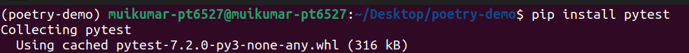
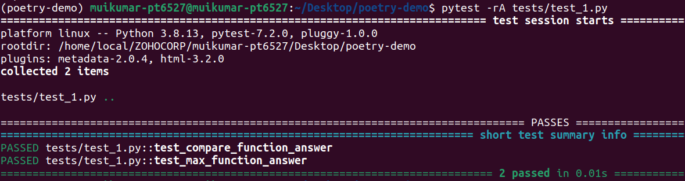
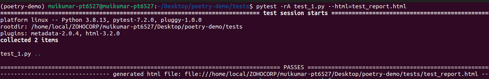
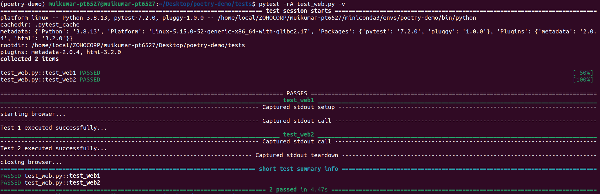
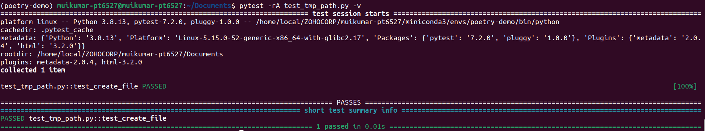

## week 2: day 2  
#### 1 november 2022  
<h1 align="center">pytest</h1>  

1. What is a unit test?  
Unit Testing is a type of software testing where individual components of a software are tested. The purpose is to validate that each unit of the software code performs as expected.  
1. Write few unit tests and run pytest
__pytest__ is a testing framework that allows users to write test codes using Python programming language. It helps you to write simple and scalable test cases for databases, APIs, or UI.  
To install pytest:  
```
$ pip install pytest
```

  
Testing the following code:  
```
def compare_two_numbers(num1: int, num2: int) -> bool:
    return num1 == num2


def max_of_two_numbers(num1: int, num2: int) -> int:
    return num1 if num1 > num2 else num2


def test_compare_function_answer():
    assert compare_two_numbers(3, 3) == True
    assert compare_two_numbers(2, 4) == False
    assert compare_two_numbers(50, 40) == False


def test_max_function_answer():
    assert max_of_two_numbers(20, 10) == 20
    assert max_of_two_numbers(10, 10) == 10
```
  
3. Get the report of those runs
we can save the test reports as html or xml files.  
To save test report in html file we have to install `pytest-html` package.  
```
$ pip install pytest-html
$ pytest -rA [file] --html=[file_name]
```
  
4. Write sample pytest fixtures and Reuse them inside uni tests  
Program to open websites with given url by using fixtures.  
```
import pytest
import webbrowser

chrome_path = "/usr/bin/google-chrome %s"
browser = None


@pytest.fixture(scope="module")
def setup():
    print("starting browser...")
    global browser
    browser = webbrowser.get(chrome_path)
    yield browser
    print("closing browser...")


def test_web1(setup):
    browser.open("https://www.google.com")
    print("Test 1 executed successfully...")


def test_web2(setup):
    browser.open("https://www.geeksforgeeks.com")
    print("Test 2 executed successfully...")
```
  
5. Use temporary directories and files:  
You can use the tmp_path fixture which will provide a temporary directory unique to the test invocation, created in the base temporary directory.  
```
# content of test_tmp_path.py
CONTENT = "This is wrote in python programming language"


def test_create_file(tmp_path):
    d = tmp_path / "my_python_folder"
    d.mkdir()
    p = d / "python.txt"
    p.write_text(CONTENT)
    assert p.read_text() == CONTENT
    assert len(list(tmp_path.iterdir())) == 1
    assert 1
```
  
The above code create a temporary folder called `my_python_folder` and creates a text file called `python.txt` with content in the `CONTENT` variable.
The create file will be located at`/tmp/pytest-of-muikumar-pt6527/pytest-4/test_create_file0/my_python_file
`
6. what is conftest.py  
The conftest.py file providing fixtures for an entire directory. Fixtures defined in a conftest.py can be used by any test in that package without needing to import them .  
conftest.py is placed in the code directory under `tests` folder.  
1. Mock objects:  
   A mock object is a fake object in the system that decides whether the unit test has passed or failed. It does so by verifying whether the object under test called the fake object as expected. There’s usually no more than one mock per test.  