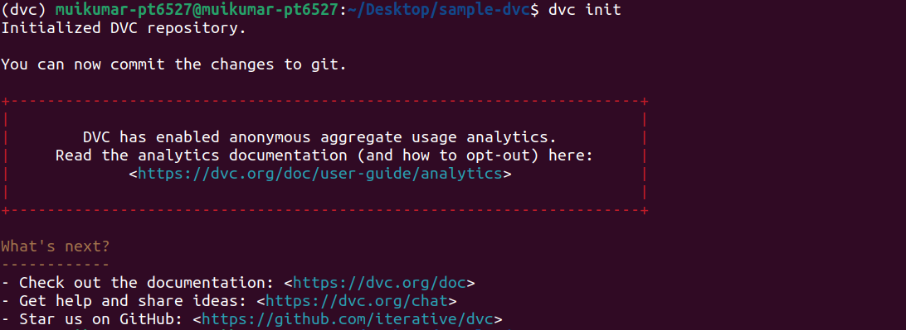
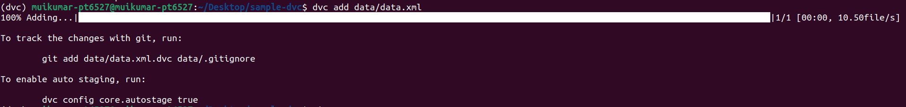
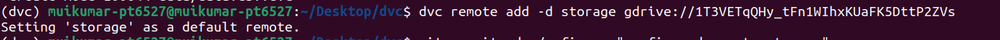
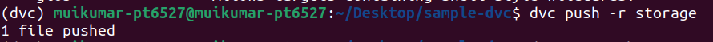

## week 2: day 3  
#### 2 november 2022  
<h1 align="center">poetry (learn with why to use it)</h1>  

when we working on a python project, sometimes we might need some external python packages. Correct version of each package make our project work well. After an update of package it might not work as it before which might broke our project. So we need package manager to manage all the packages inside our project.  
Poetry is one of the package manager for managing python packages. Poetry generates a lock file with the exact version and hash of each version installed. When sharing the project, this ensure that the exact same version will be used everywhere to run the project. As poetry.lock file is small in size it can be commit into to git to ensure all the team using the same version of dependencies.  
peotry.lock file prevents the auto updation of dependencies installed inside out projects.  
poetry also creates a pyproject.toml file. It is standard for defining build requirements in python projects. Instructions inside this file are recongized and use for dependency management by poetry.  
We can separate project packages and develpment packages inside the pyproject.toml file.  
`poetry install` command installs all the dependencies listed in poetry.lock file if file is present or create from pyproject.toml file.  
`poetry update` command will look for the latest version of each dependency listed in the pyproject.toml and create or replace the poetry.lock file.  
To update a dependency to its latest of specific version:  
```
poetry add [dependency]@[version]
```
to updata latest version we can use `latest` in `version` placeholder.  
to add a dependency in development dependency subtable we have suffix with `--dev` or `-D`  

__What conda is preferred over venv?__  
1. conda can create a generic vitual environment it allows us to manage packages from different languages along with python.  
2. conda environments all get stored in a single folder so we can easily look up all environments we have created and we can reuse the environment for multiple projects.  
3. we can share conda environments as a yaml file with a single commnad easily.  
   ```
   $ conda env export > environment.yml
   ```
   we can create the conda environment from the saved yml file.  
   ```
   conda env create -f environment.yml
   ```
   We can also pack and unpack conda environment as a sharable tar file by using `conda-pack` package.  
4. It is easy to setup environmet for data science and ml projects by using conda package.  
5. We can easily create virtual environment with different versions of python but in venv we need extra tools to manage python versions.  
<h1 align="center">DVC</h1>  
DVC is a data version control command line tool writen in python. It is used to manage changes to models and datasets.
To install dvc using pip:  
```
$ pip install dvc
```
To initiate a folder as a dvc repository:  
```
$ dvc init
```

  

After initialization of dvc repository, dvc create a .dvc file which points to the actual data file that is stored in the remote storage.  
In datascience and machine learning the data sets and data models are large in size. So it not possible to track them using git as it stores file are in small size. In this senario the actual data address is stored in .dvc file and it can be stored in github as it is lightweight.  
To grab data from remote storage to local machine we can use dvc get commnad.
To add data file to dvc:  
```
$ dvc add [file]
```
  
After this we have to add the data file in .gitignore file and commit commit the .dvc file to git.  
```
$ git add [file]/.gitignore [file]
```
To add remote storage to dvc (in this am using google drive as remote storage):  
```
dvc remote add -d storage gdrive://[gdrive-folder-id]
```
  
To support dvc, gdrive as remote storage we have to install the following tool.  

```
$ pip install dvc[gdrive]
```
To commit the .dvc/config file to git:  
```
git commit .dvc/config -m [message]
```
To push the data file to configured remote storage:  
```
$ dvc push
```

DVC is technically not a version control system, git is doing the version controlling and dvc is helping to extend git version control to files we want to keep outside of git like a big dataset.  