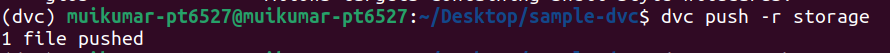

## week 2: day 4  
#### 3 november 2022 
<h1 align="center"> DVC </h1>
In data science or machine learning the data sets and data models are large in size. So it is very difficult to track manually or with version control systems like git. To track these data sets and models we can use Data version Control(DVC). DVC is a command line tool written in Python. It made tracking large data sets and models easy.  
To install DVC:  
```
pip install dvc
```
DVC works on the top of git so we need initialize inorder to work with DVC.  
```
$ git init
```

  

After initalizing git we can initialize DVC:  
```
$ dvc init
```
  
After initalizing DVC, .dvc folder will be created which is responsible for tracking for tracking the large data files.  
To track data file with DVC:  
```
$ dvc add [file]
```
  

After the above command the following operations will be performed.  
1. calculate the file hash. By using md5 hashing algorithm and content of file as input string dvc generates a 32 character length hash value.  
2. move the file contents to the cache by naming the file as generated hash value(name is from 3rd character to last character).  
3. Create a corresponding .dvc file to track the file, using its path and hash to identify the cached data.  
4. Add the targets to .gitignore in order to prevent them from being committed to the Git repository.  

To add remote storage:  
I am adding google drive as remote storage.  
```
$ dvc remote add -d [name] gdrive://[id]
```
  
We can add any directory outside of the working directory as remote storage.  
```
$ dvc remote add -d [name] [path]
```
  
.dvc/config file stores the remote storage path so we have to add this file to git inorder to track the remote storages.  
```
$ git add .dvc/config
$ git commit -m [message]
```
To push the data file to the remote storage:  
```
$ dvc push -r [name]
```
  
To pull the data file from the remote storage:  
```
$ dvc pull -r [name]
```
  
__practice__:  
Make changes in the data file and navigating forth and back in the versions of data file:  
  
In the above image, I am copying the the contents of original data file into another temparary file. After that I am appending the contents of copied file into original file to make it double in size. (I am doing these operations after commiting the changes into git).  

  
After that I am tracking the changes with dvc by dvc add command. commiting the generated .dvc file to git to keep track of vertions of data and push data into remote storage.  
  
I switched to the previous version of .dvc file in git and used dvc checkout command to keep dvc in sync with .dvc file.  
__cache__:  
cache is a folder in .dvc. cache folder is used to store the data files in our local machine. cache folder contain 256 sub folders with names from 00 to ff. When we add file to dvc it generates a unique hash value with input string as file contents by using `md5` hashing algorithm. To store a file in cache the generated hash is divided into two parts  
first part= first two character of hash value.  
second part= remaining character of hash value.  
the first part is range from 00 to ff, and file name which would be stored in cache is the second part of hash value. So file stored in the cache in the following way:  
generated hash= 22a1a2931c8370d3aeedd7183606fd7f.  
first part= 22.  
second part= a1a2931c8370d3aeedd7183606fd7f.  
So the file store in the `22` subfolder of cache folder with `a1a2931c8370d3aeedd7183606fd7f` as file name.  
```
outs:
- md5: 22a1a2931c8370d3aeedd7183606fd7f
  size: 14445097
  path: data.xml
  ```
  
__why hashing__  
hash in dvc is used to correctly identify the files. Whenever we push or pull the data files, dvc check the specific file is correct file or not by comparing file name + folder name (by combining the file name and folder name we will get the hash of data file) with the generated hash( dvc generates the hash value with the file contents). If both the hashes are matched then the file is not modified and it is correct file. 
Hashing can be used to protect files from corruption and can be used for storage files in the cache folder.  
__links__  
File links are lightweight entries in the file system that don't hold the file contents, but work as shortcuts to where the original data is actually stored.  
There are 3 types of links that are supported by dvc:  
1. reflink  
2. hardlink  
3. softlink or symlink  
__reflink__  
These links are work on `copy on write` machanism. That means whenever we try to modify data file in place, the file system takes care of copying the file, so there will be no cache corruption.  These are the most efficient links available at this time but only few operating systems support reflink.  
__hardlinks__  
These links are best to use when your cache directory and working repository are located in the same partition. These links optimize speed and space in the file system but may break your workflow since updating hard/sym-linked files tracked by DVC in the workspace would cause cache corruption.  
__softlinks or sym links__  
These links are best to use when your cache directory and working repository are located in different partitions. These links have same problem that the hardlinks had.
To see the configured links:  
  
It choose the first available link form the list of link types.  
To sync the links in the config file we have to use the following command:  
```
$ dvc checkout --relink
```