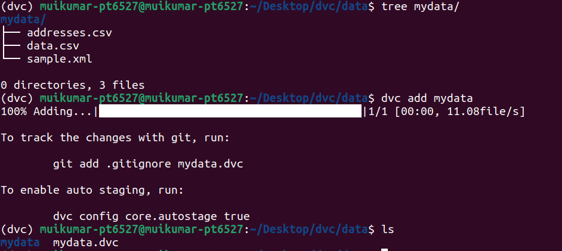
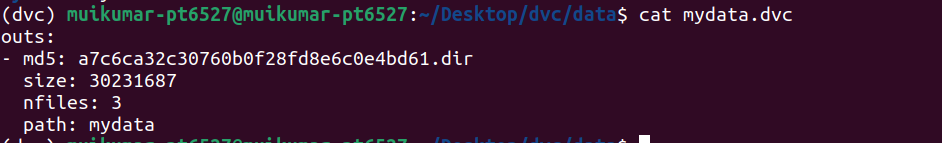
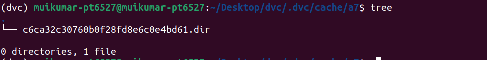
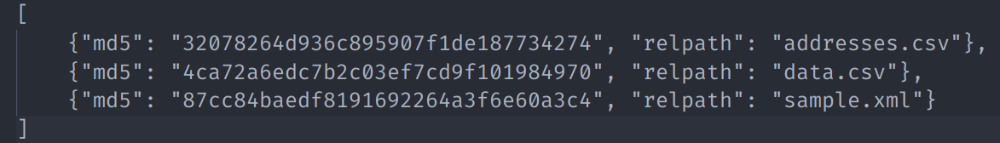

## week 4: day 3  
#### 16 november 2022 
<h1 align="center"> How a directory will be added to dvc</h1>  

When we add a dirctory to dvc then every file in the dir is cached normally, but DVC does not produce individual .dvc files for each one. Instead, the single .dvc file references a special JSON file in the cache (with .dir extension), that in turn points to the added files.  

  
`mydata` folder contain three files and I added that folder to dvc. After adding the folder, `mydata.dvc` file was generated.  
That file contains the following information:  
  
md5 hash represents the path to that file in the cache directory and `nfiles` indicate the number of files that are present in that folder.  
  
In that cache folder inside `.dvc` directory there is a file with `.dir` extension.  
  
It is in JSON format and each json object represents file hash and file name. we can reach a specific file with md5 hash in the json object.  

we can use `-R` or `--recursive` which causes every file in the hierarchy to be added individually. A corresponding .dvc file will be generated for each file in the same location.  

<h1 align="center"> Regular Expressions</h1>  
Regular expressions or “regexes” will enable us to examine patterns within our code. For example, we might want to validate that an email address is formatted correctly.  
Python has an existing library called re that has a number of built-in functions that can validate user inputs against patterns.  
One of the most versatile functions within the library re is search.  
The search library follows the signature 

`re.search(pattern, string, flags=0).`  
many special symbols can be passed to the compiler for the purpose of engaging in validation.  
A non-exhaustive list of those patterns is as follows:  

```
.   any character except a new line
*   0 or more repetitions
+   1 or more repetitions
?   0 or 1 repetition
{m} m repetitions
{m, n} m-n repetitions
^   matches the start of the string
$   matches the end of the string or just before the newline at the end of the string
[]    set of characters
[^]   complementing the set
\d    decimal digit
\D    not a decimal digit
\s    whitespace characters
\S    not a whitespace character
\w    word character, as well as numbers and the underscore
\W    not a word character
A|B     either A or B
(...)   a group
(?:...) non-caputuring version
| it same as "or" in python
```
To validate a email address we have to use the following regular expression.  

```
import re

email = input("What's your email? ").strip()

if re.search(r"^\w+@(\w+\.)?\w+(com|edu|gov|net|org)$", email):
    print("Valid")
else:
    print("Invalid")
```
Explanation:  
here `r` represents a raw string ie,treats backslash (\) as a literal character instead of escaping character. `^\w` is used to ensure that email addresses is starts with [a-z or A-Z or 0-9 or _] and `+` is used to ensure that email address contain atleast 1 character before the @ symbol. most of the email addresses contain `@` symbol. after @ symbol we used `(\w+\.)?` to validate the subdomains `(example@subdomain.domain.org)`.(`com|edu|gov|net|org)$` used to check that email address is ends with any of the listed domains.  
**Cleaning Up User Input**  
Most of the time we save users data in csv or table format for that we have to structure the data. for example we want to store the users name as first name and last name. for that we have to split the username into two fields ie. first name and last name. But for that operation we need a delimeter to split the name. most of the peple use `,` as delimeter but the problem is some users may enter space along with comma. One of the way to solve that problem is regular expression.  
```
import re

name = input("Please enter your name ").strip()
if matches := re.search(r"^(.+), *(.+)$", name):
    name = matches.group(2) + " " + matches.group(1)
print(f"hello, {name}")
```
